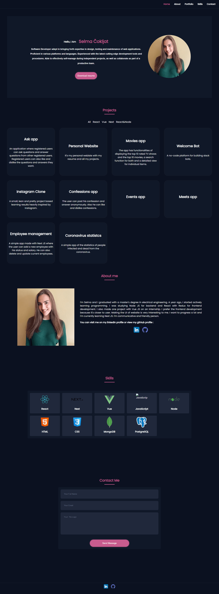

# personal-website-nextjs


[](https://github.com/prettier/prettier)
[](https://github.com/scokljat/personal-website-nextjs/blob/main/LICENSE)

A responsive personal portofolio with my skills, qualifications, education and experiences.



## Getting Started

In the project directory, you can run:

Clone the repository using **Git**:

```
https://github.com/scokljat/personal-website-nextjs
```

For installing the dependencies run:

```bash
npm install
```

Run the development server:

```bash
npm run dev
```

Open [http://localhost:3000](http://localhost:3000) with your browser to see the result.
